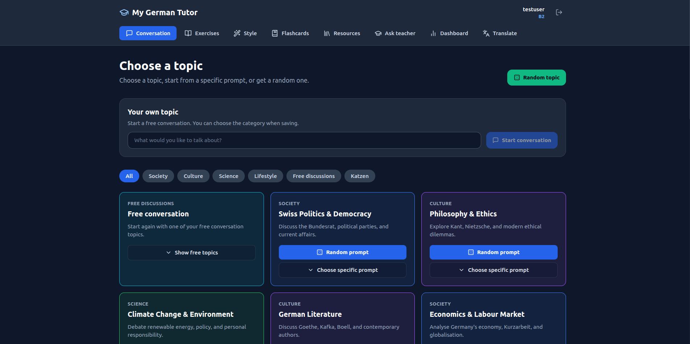
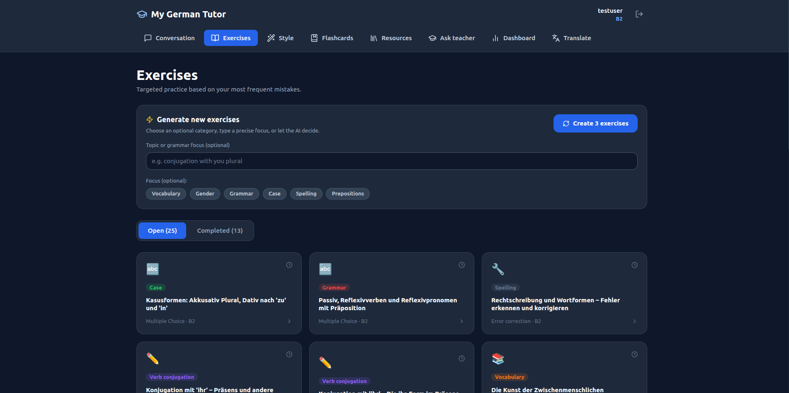
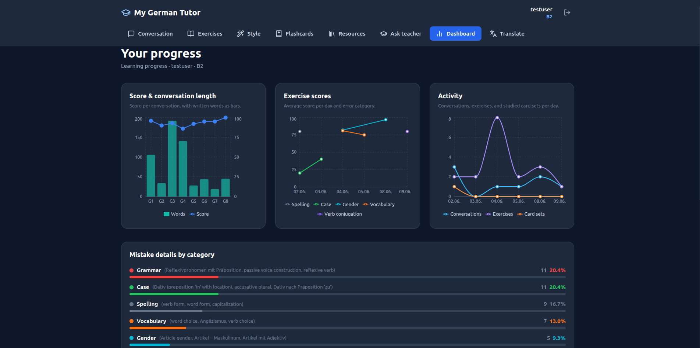

# My German Tutor

After reaching an intermediate level in German, I found myself making the same mistakes over and over again. Those mistakes don't get corrected when you speak to people in your every day life, and they tend to stick. That's why I built My German Tutor, a pocket tutor that remembers your mistakes and helps you work on them.

## Features

- Chat with your tutor by text or voice about topics that interest you
- Get corrections and explanations for your mistakes
- Let your tutor keep track of your errors and generate exercises tailored to your needs
- Have your sentences rewritten in different styles or dialects and listen to them
- Generate flashcards on topics of your choice
- Ask your tutor to explain German grammar and language rules

## Screenshots

### Conversations


### Exercises


### Dashboard


## Technology stack

### Backend

- FastAPI
- Supabase PostgreSQL

### Frontend

- React

## Testing

The project includes:
- API smoke tests for core endpoints
- Authorization tests ensuring users cannot access another user's data
- Mocked tests for AI, speech, and translation providers

Run the test suite with:

```bash
pytest
```

## Notes

- Sign up is currently disabled.


## License

The source code in this repository is licensed under the MIT License.

The file `backend/content/nouns_cleaned.csv` is derived from:
https://github.com/gambolputty/german-nouns

Original license: CC BY-SA 4.0

Modifications:
- Removed unused columns
- Filtered entries

The file `backend/content/nouns_cleaned.csv` remains licensed under CC BY-SA 4.0.